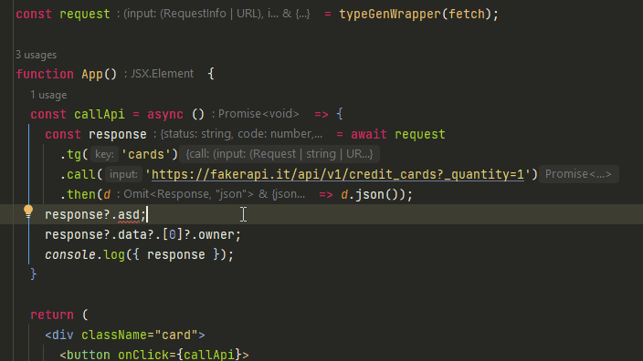

## Request TypeGen

Dynamic type generator for API responses.



> Current version is more of a proof of concept. It works, and it may be used in production since it's only designed for use during development. But it's not yet optimized, and you might need to do some extra steps to make it work in some environments.

Making requests to API is a common task in any application. But adding types can be a tedious task, especially if API is in active development and changes return fields. This library aims to make it easier by generating and updating types for you. The only question you have to ask yourself is: Are you lazy enough to install a library to not do something trivial manually?


## Installation

To install type gen simple run:

```sh
npm install --save @vmagination/request-typegen
```
```sh
yarn add @vmagination/request-typegen
```

Add global types file to typescript config (tsconfig.json). It will not exist until you generate types for the first time.

```text
{
  ...
  "include": [..., "typeGen.d.ts"]
}
```

## Notes for specific environments

<details>
<summary>Node</summary>

Use different import paths

```js
// "moduleResolution": "NodeNext",
import { typeGenWrapper } from '@vmagination/request-typegen/node';
// "moduleResolution": "Node", or others
import { typeGenWrapper } from '@vmagination/request-typegen/for/node';

```
</details>
<details>
<summary>Vite</summary>

Add dev dependency ```vite-plugin-fs```

And use different import paths
```js
// "moduleResolution": "NodeNext",
import { typeGenWrapper } from '@vmagination/request-typegen/vite';
// "moduleResolution": "Node", or others
import { typeGenWrapper } from '@vmagination/request-typegen/for/vite';

```
</details>
<details>
<summary>React-native</summary>

Starting file server is required to generated types
```sh
  npx typegen-file-server start --port 4832
```
or open in new terminal
```shell
  start "typegen server" npx typegen-file-server start --port 1234
```
Default port is 4832

Use different import paths and add file server url to config
```js
// "moduleResolution": "NodeNext",
import { typeGenWrapper } from '@vmagination/request-typegen/react-native';
// "moduleResolution": "Node", or others
import { typeGenWrapper } from '@vmagination/request-typegen/for/react-native';

const request = typeGenWrapper(fetch, {
  enabled: __DEV__,
  fsUrl: 'http://${externalIP}:${port}',
});
```
</details>
<details>
<summary>Any other environment</summary>

Starting file server is required to generated types
```sh
  npx typegen-file-server start
```
or open in new terminal
```shell
  start "typegen server" npx typegen-file-server start --port 1234
```
Default port is 4832

Add file server url to config
```js
import { typeGenWrapper } from '@vmagination/request-typegen';

const request = typeGenWrapper(fetch, {
  enabled: __DEV__,
  fsUrl: 'http://localhost:4832',
});
```
</details>

## API reference

### typeGenWrapper

`typeGenWrapper(requestFn, config)`

A brief description of what the function does and its purpose in the library.

#### Parameters

- `requestFn` (Function): Can be literally any function that accepts any parameters and returns any value. Will be wrapped and extended.
- `config` (TypeGenConfig): Configuration for type generation.
```ts
type TypeGenConfig<T extends Fn, RT extends Promise<any>> = {
  enabled?: boolean; // should enable type generation, pass isDev flag here
  ignoreConstructors?: boolean; // should generate types for non-default objects
  writeFile: (path: string, content: string) => any | Promise<any>;
  // ^ overrides default writeFile function for saving type file
  readFile: (path: string) => any | Promise<any>;
  // ^ overrides default readFile function for reading saved type file
  fileExists: (path: string) => any | Promise<any>;
  // ^ overrides default fileExists function for checking saved type file
  focusField?: string; 
  // ^ focus on specific return field for type generation, the field can be a function
  // ^ must be provided if the field is not json (fetch) or data (axios)
}
```

#### Return Value

Returns wrapped original function with extended functionality. All added methods do the same thing, but with different call formats.

All methods require the addition of a type generation key (string). It is recommended to use the endpoint's static name as a key.

```ts
type TypeGenWrapperResult<T extends Fn> = T & {
  withTypeGen: <K extends string>(key: K) => {
    call: (...args: Parameters) => any | GeneratedType
  };
  callWithTypeGenKey: TGVariant1<Parameters<T>>;
  tg: <K extends string>(key: K) => {
    call: (...args: Parameters) => any | GeneratedType
  };
  tgS: <K extends string>(key: K, ...args: Parameters) => any | GeneratedType;
  tgE: <K extends string>(...args: [...Parameters, K]) => any | GeneratedType;
};
```

#### Example

```javascript
// Simple default fetch wrapper

const request = typeGenWrapper(fetch);

const result = await request.withTypeGen('getUsers').call('https://myapi.com/users');
const result = await request.tg('getUsers').call('https://myapi.com/users');
const result = await request.tgS('getUsers', 'https://myapi.com/users');
const result = await request.callWithTypeGenKey('getUsers', 'https://myapi.com/users');
const result = await request.tgE('https://myapi.com/users', 'getUsers');

```
```javascript
// Axios wrapper

const request = typeGenWrapper(axois, {
  getReadableResponse: (res) => res.data,
});

const result = await request
  .tg('postUsers')
  .call('https://myapi.com/users', { method: 'POST' });
const result = await request
  .withTypeGen('postUsers')
  .call('https://myapi.com/users', { method: 'POST' });
const result = await request
  .tgS('postUsers', 'https://myapi.com/users', { method: 'POST' });
const result = await request
  .callWithTypeGenKey('postUsers', 'https://myapi.com/users', { method: 'POST' });
const result = await request
  .tgE('https://myapi.com/users', { method: 'POST' }, 'postUsers');

```

## ToDo list
- [ ] Find a way to derive stable key from function arguments
- [ ] Find a way to avoid using file server or a way to start it automatically
- [ ] Find a reason to continue development
